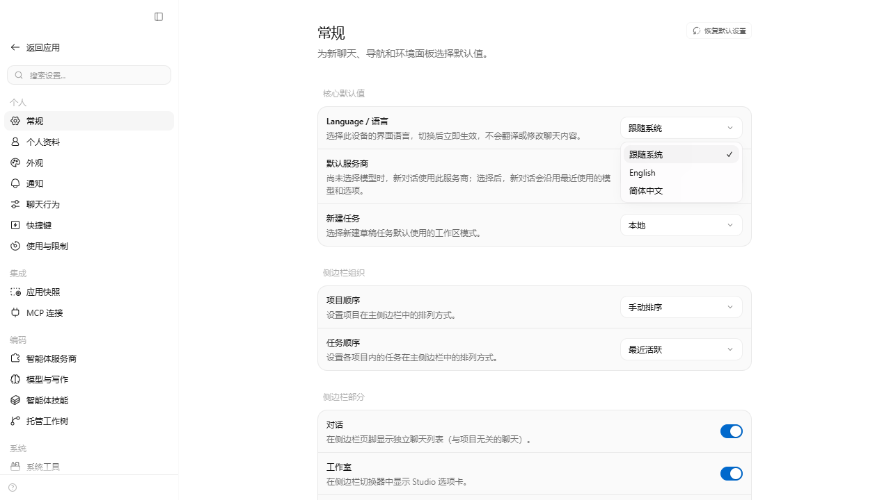

# Synara 中文版

当前版本：**v0.8.4-cn.1**，基于 [Synara v0.8.4](https://github.com/Emanuele-web04/synara/releases/tag/v0.8.4)，由本 fork 维护。目前提供 Windows x64 安装包，支持简体中文与英文界面。

[下载最新版](https://github.com/panda4556/synara/releases/latest) · [本版安装包](https://github.com/panda4556/synara/releases/download/v0.8.4-cn.1/Synara-0.8.4-cn.1-x64.exe) · [更新日志](./CHANGELOG.zh-CN.md) · [上游项目](https://github.com/Emanuele-web04/synara)

## 本版更新

- 同步上游 v0.8.4：工作区文件与差异编辑、自动保存、浏览器会话保存、欢迎引导、推理强度滑块及性能改进。
- 补充新增功能的中文文案，保护编辑器、纯文本输入、账号名称和浏览器配置名称，不改写用户内容。
- 保留 **跟随系统 / System default、English、简体中文** 三种选择，切换立即生效，偏好保存在本机。



## 安装与升级

1. 下载 **`Synara-0.8.4-cn.1-x64.exe`**；GitHub 的 `Source code (zip/tar.gz)` 是源码，不是安装包。
2. 保存工作并正常退出 Synara。备份数据目录 `%USERPROFILE%\.synara` 和桌面配置 `%APPDATA%\synara`；自定义数据目录也应一并备份。
3. 校验安装包，运行安装程序，并沿用原安装位置。
4. 打开 **设置 → 常规 → Language / 语言**（英文为 **Settings → General → Language / 语言**），选择所需语言。

默认跟随系统/浏览器首选语言；未支持的语言回退英文。也可固定为 English 或简体中文。在设置中搜索 `Language`、`English`、`中文`、`语言` 或 `跟随系统` 可以找到入口。恢复默认设置会重置语言偏好。

安装包版本为 `0.8.4-cn.1`，Windows 文件属性可能显示 `0.8.4.0`。若仍显示旧版，请检查旧进程是否已退出，以及快捷方式是否指向另一份安装。

升级可能执行上游数据库迁移。若需回退，请先退出程序并另存升级后的数据，再恢复升级前匹配的完整备份和旧版程序。不要用旧版程序直接打开迁移后的数据库；备份可能含凭据和聊天记录，不要公开上传。

上游 v0.8.4 移除了旧的对话高亮/下划线标记及其存储数据，对话、固定消息和笔记保留。使用过旧标记功能的用户应先备份再升级。

## 文件校验与签名

安装包**未进行代码签名**，Windows 可能显示未知发布者或 SmartScreen 提示。请核对下载来源，并将以下命令的结果与本版 `artifact-win-x64.provenance.json` 中安装包的 SHA-256 比对：

```powershell
Get-FileHash -LiteralPath .\Synara-0.8.4-cn.1-x64.exe -Algorithm SHA256
```

该来源记录包含源码提交、锁文件和附件校验值，不是第三方认证。SHA-256 用于验证文件一致性，不能替代发布者签名或安全审计。

## 范围与限制

- 翻译导航、设置、菜单、按钮、提示和常见动态状态；保留产品名、模型名和技术标识符。
- 不翻译聊天正文、用户输入、文件内容、代码或终端输出；不改变服务商账号、模型调用、额度和计费方式。
- 语言入口使用原生 React 文案；已有界面仍使用可停用的兼容翻译层，并非上游已完成全量原生 i18n。切回英文会停用兼容层并恢复原文。
- 未覆盖文案和部分原生系统界面仍可能显示英文。当前仅发布 Windows x64，不声明 macOS/Linux 构建验证。
- 语言偏好保存在本机；清理或禁用存储可能使选择无法跨重启保留。
- **当前仍需手动更新**。Release 的 `latest.yml` / `synara.yml` 与上游格式一致，但不会为现有安装包启用自动更新。官方安装包不保证包含此语言功能。

## 源码与验证

- 安装包源码：[e7ebbd7972a6f7fe7992ceec33f58dafae0a1b49](https://github.com/panda4556/synara/commit/e7ebbd7972a6f7fe7992ceec33f58dafae0a1b49)，标签 `v0.8.4-cn.1`。
- 上游基线：[70f5ed0e4757c0f69891b258171da80d324f0e18](https://github.com/Emanuele-web04/synara/commit/70f5ed0e4757c0f69891b258171da80d324f0e18)。
- 维护分支：[zh-cn-v0.8.4](https://github.com/panda4556/synara/tree/zh-cn-v0.8.4)。首页与验证记录可独立更新，不改变已发布安装包。
- 本地化、设置搜索、新引导及编辑器状态相关 82 项单元测试通过；语言与编辑器 9 项 Chromium 组件测试通过。
- 全仓类型检查、Lint（0 错误）、Windows 运行时边界检查、迁移兼容性检查、Web/Server/Desktop 生产构建通过。
- 最终安装包的解包依赖检查和隔离启动通过；本机从 0.8.3-cn.1 升级后，原有对话、中文引导及完整设置页双向语言切换已验证。
- 全仓测试和格式检查**并非全绿**：Windows 上的上游测试含 POSIX 路径/权限假设，格式检查还受到本地 CRLF 和临时文件影响。本次修改的代码格式检查通过。完整边界见[验证记录](./docs/releases/v0.8.4-cn.1-validation.md)。

实现与测试命令见 [LOCALIZATION.zh-CN.md](./LOCALIZATION.zh-CN.md)。Release 仅提供安装包、blockmap、构建来源记录与更新清单，使用说明、截图和许可证保留在仓库。历史版本不覆盖。

## 致谢与许可证

Synara 由 Emanuele Di Pietro 及原作者/贡献者开发。本 fork 增加中文本地化与语言选择支持，沿用 [MIT License](./LICENSE)，保留原版权与第三方依赖许可证。

## English summary

This fork's unsigned Windows x64 build is based on Synara v0.8.4. Choose **System default, English, or Simplified Chinese** in **Settings → General → Language / 语言**. The locale is saved locally; conversation text, files, code, passwords, and terminal output are not translated. Updates remain manual. Verify the installer hash against `artifact-win-x64.provenance.json`.
